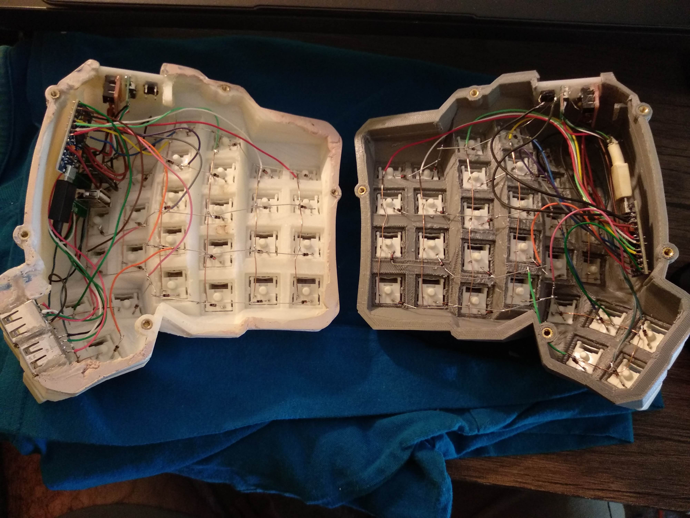

# Teclado Dactyl Manuform en español


Compilar en QMK MSYS con
```
qmk compile -kb handwired/dactyl_manuform/5x7 -km jcontrerasf
```

Para flashear el microcontrolador, primero desconectar el cable USB, luego desconectar el cable TRRS que une ambas partes del teclado. En QMK Toolbox activar la casilla `Auto-Flash`, luego conectar una de las partes del teclado al computador por USB, elegir el archivo .hex y presionar el botón reset del teclado. Desconectar el cable USB para volver a unir las partes.

Nota: solo es necesario programar ambas partes la primera vez o para cambios importantes (como añadir luces RGB) para cambios de keymap basta con programar la parte correspondiente al master (lado izquierdo en este caso).


